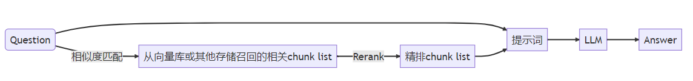
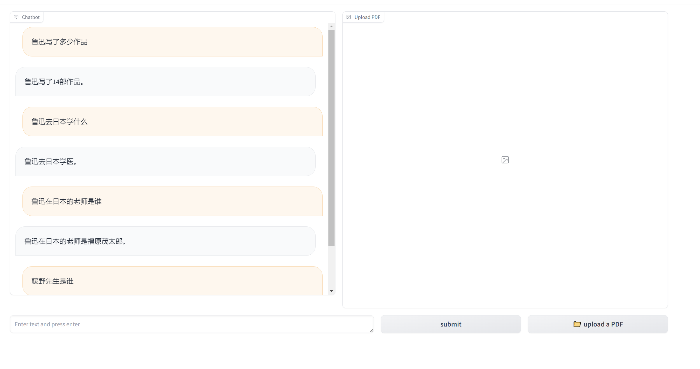

# RAG practice

One basic function project, create with LlamaIndex and LangChain framework



## Running the project

#### Starting a Qdrant docker instance

```bash
docker run -p 6333:6333 -v ~/qdrant_storage:/qdrant/storage:z qdrant/qdrant
```

#### Downloading & Indexing data

```bash
llamaIndexApp = my_app()
llamaIndexApp.process_file()
```

```bash
    insertData() # prepare data
    #main()# run app: streamlit run qdrant_app.py
```

#### Starting Ollama LLM server

Follow [this article](https://otmaneboughaba.com/posts/local-llm-ollama-huggingface/) for more infos on how to run models from hugging face locally with Ollama.


Start the model server

```bash
ollama run llama2
```

By default, Ollama runs on ```http://localhost:11434```

#### Demo running
update config.yml first and then
```bash
python gradio_app.py
```
or
```bash
streamlit run qdrant_app.py
```

## Example

#### Request

