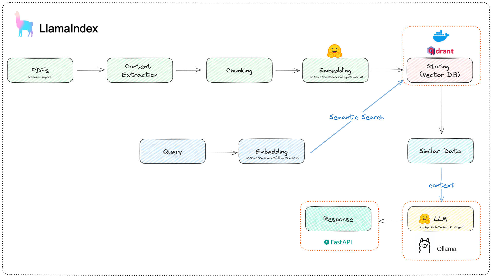

# RAG: Research-assistant

This project aims to help researchers find answers from a set of research papers with the help of a customized RAG pipeline and a powerfull LLM, all offline and free of cost.

## How it works




## Running the project

#### Starting a Qdrant docker instance

```bash
docker run -p 6333:6333 -v ~/qdrant_storage:/qdrant/storage:z qdrant/qdrant
```

#### Downloading & Indexing data

```bash
python rag/data.py --query "LLM" --max 10 --ingest
```

#### Starting Ollama LLM server

Follow [this article](https://otmaneboughaba.com/posts/local-llm-ollama-huggingface/) for more infos on how to run models from hugging face locally with Ollama.


Start the model server

```bash
ollama run research_assistant
```

By default, Ollama runs on ```http://localhost:11434```
